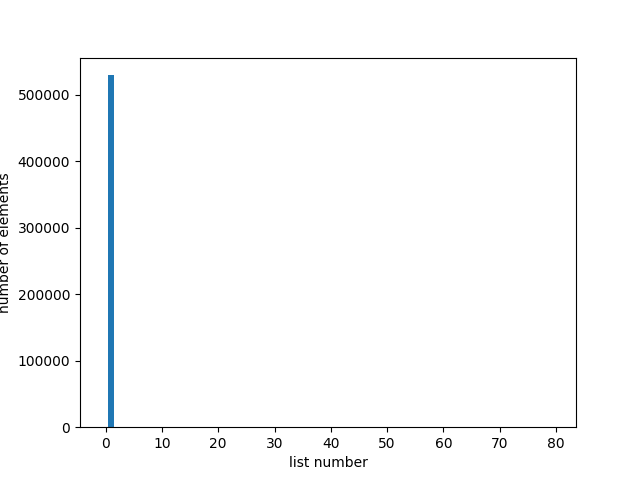
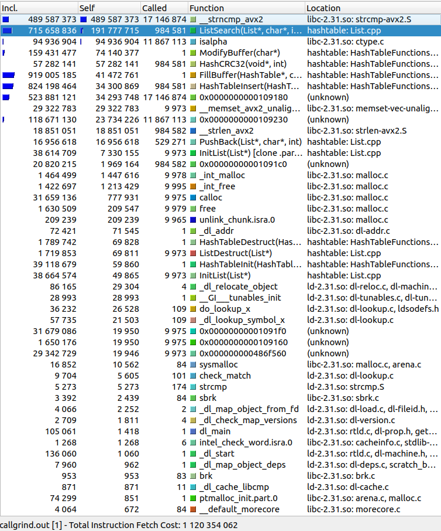
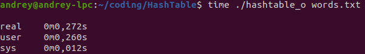
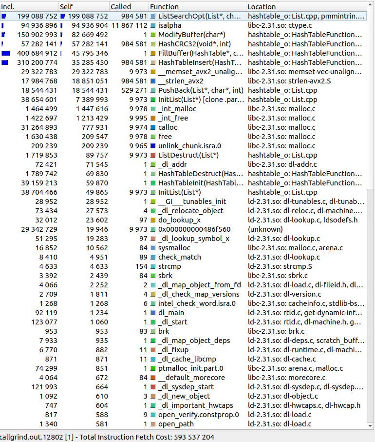
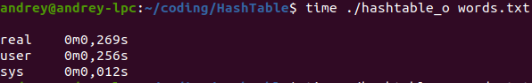

# HashTable with chaining

This is implementation of hash table (also known as hash map). The aim is to optimize hash table as much as possible. To achieve this I use functions written on Assembly language as well as Intel intrinsics. As a text base I use 8.5MB txt file with the most commonly used WI-FI passwords. The size of hash table is 9973. All test done on AMD Ryzen 7 4800H with -O2 -mavx2 gcc flags.

## Testing hash functions

First and foremost, I want to compare following hash functions:
1) Returns 1 on every set of bytes
2) Returns word length
3) Return ASCII code of first word letter
4) Return sum of ASCII codes that word is consisted of
5) ROL hash
6) [CRC32 hash](https://en.wikipedia.org/wiki/Cyclic_redundancy_check#CRC-32_algorithm)

### 1. Returns 1
.


As we can see form the graph, the effectiveness of this hash function is slightly approaching zero. So I would not use it in optimization.

### 2. Returns word length
.


Due to the fact that word length is not longer than 16, the question of usage this hash is out of discussion...

### 3. Returns ASCII symbol of first letter
.

What a pitty. This function isn't able to occupy all hash table. I won't use it.

### 4. Returns sum of ASCII symbols
.


While this hash function is much better than previous, I still cannot use it as a primary one. Hash value ranges from 0 to 2000 but size of table is almost 10000.

### 5. ROL hash
.


This hash function is able to fill(finally) all hash table. Nevertheless, elements aren't divided evenly.

### 6. CRC32
.


CRC32 seems to be the most balanced function. I'll keep it to do optimizations.

## Optimizing hash table
I use callgrind to understand what to optimize. Let's run it:

.

As wee can see from the data, the slowest functions are FillHashTable and FillBuffer. However, they are called only once. Taking this into consideration, I will optimize ListSearch function. I will use Intel intrinsics to compare strings. This is the execution time before optimizing:

.

This is ListSearch before optimizations.
```
int ListSearch (List *lst, const DATA str, const int length) {
    assert (lst);
    assert (str);

    for (int i = 0; i < lst->size; i++) {
        if (STR_EQ (str, lst->list[i].value, length)) {
            return i;
        }
    }

    return -1;
}
```
After modifying:
```
int ListSearch (List *lst, const DATA str, const int length) {
    assert (lst);
    assert (str);

    int cmp = 0;

    __m128i string = _mm_lddqu_si128 ((__m128i *)str);
    __m128i listStr {};

    for (int i = 0; i < lst->size; i++) {

        listStr = _mm_lddqu_si128 ((__m128i *)lst->list[i].value);

        cmp = _mm_cmpestrc (listStr, 16, string, length, _SIDD_CMP_EQUAL_EACH);

        if (cmp != 0)
            return i;
    }

    return -1;
}
```
Let's now see the results:

.

Fine...we got 67% boost.

Hmm, it's time to look at callgrind again:

.

Function FindLastLetter calls isalpha, so I decided to optimize it. I'll write this function on Assembly.
Here it is:
```
isalphA:

        saveregs

        cmp rdi, 'A'
        jb not

        cmp rdi, 'Z'
        jb alpha

        cmp rdi, 'a'
        jb not

        cmp rdi, 'z'
        jb alpha

not:    mov rax, 0
        jmp end

alpha:  mov rax, 1

end:    restoreregs

        ret
```

.

We got 4% boost. Well, it is an optimization. 4% is better that 0.
Next function is HashCRC32. Obviously, it counts hash. First of all, I'll write it in Assmebly. It is C version:
```
int HashCRC32 (void *str, const int length) {
    assert (str);

    char *str1 = (char *)str;

    unsigned int crc = 0xFFFFFFFFUL;

    for (int symb = 0; symb < length; symb++)
        crc = CRCTable [(crc ^ *(str1 + symb)) & 0xFF] ^ (crc >> 8);
 
    return crc % HASHTABLESIZE; 
}
```

ASM:
```
CRC32Computing:     

                ; pushparams      ; rdi - buffer
                saveregs          ; rax - index, rdx - symbol, rbx - res

                                             ;unsigned long res = 0xFFFFFFFF; 
                mov ebx, 0xFFFFFFFF          ; rbx = res

                mov rcx, rsi
                mov rsi, rdi

                add rcx, 4
                xor rax, rax                 ; int index = 0 = rax
                xor rdx, rdx                 ; int symbol = rdx;
                xor r8, r8                   ; int i = 0;

loopStr:        cmp r8, rcx                  ; i < length + 4
                jae endOfProc                ; break

                mov rax, rbx                 ;
                shr rax, 24                  ; index = (res >> 24) & 0xFF;
                and rax, 0xFF                ; 

                sub rcx, 4                   ;
                cmp r8, rcx                  ; if (i < length)
                jae zero_symbol              ;       symbol = *(str1 + i); 
                                             ; else
                                             ;      symbol = 0x0;

                mov dl, byte [rsi]

                jmp continue

zero_symbol:    xor rdx, rdx

continue:       shl rbx, 8                              ; res = (res << 8) | symbol;
                                                        ; res ^= table1[index];
                or rbx, rdx 

                xor rbx, [crctable + rax * 4]

                inc r8
                inc rsi
                add rcx, 4
                jmp loopStr

endOfProc:

                mov rax, rbx

                restoreregs

                ret
```

.

Unfortunately, this function slows down my program. Maybe, I'm not good at writnig asm code. Definetely, compiler writes on asm better than me)

Besides that, I want to try crc32 on intrinsics. That's how it looks:
```
int HashTableInsert (HashTable *table, char *str, int length, int (* HashFunction)(void *, int)) {
    assert (table);
    assert (str);

    unsigned int hash = 0;

    for (int i = 0; i < length; i++) {
        hash = _mm_crc32_u8 (hash, str[i]);
    }

    int res = ListSearch (&(table->listArr[hash % table->size]), str, length);

    if (res == -1)
        PushBack (&(table->listArr[hash % table->size]), str);

    return OK;
}
```

.

6% percent boost. That's OK.

As we can see from callgrind, there is function called ResizeListUp. It calls when list size equals list capacity. To avoid calling it, I'll set initial capacity of list 100. Unfortunately, it doesn't give any boost.

## Results discussion

    To sum up, we optimize our hash table by 70.5%. The main boost is given by using intrinsics. Unfortunately, I cannot compete with compiler in writing good asm code. It doesn't benefit at all. Maybe, if I used -O0 flag, we were able to notice boost, but I used -O2.
