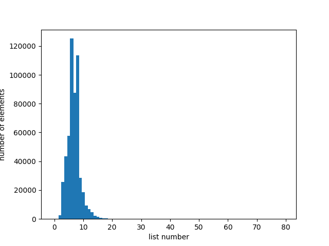

# HashTable using chaining method

This is implementation of hash table (also known as hash map). The aim is to optimize hash table as much as possible in terms of execution time. To achieve this I use functions coded on Assembly language as well as Intel intrinsics. As a text base I use 8.5MB txt file with the most commonly used WI-FI passwords. The size of hash table is 9973. All tests done on AMD Ryzen 7 4800H with -O2 -mavx2 gcc flags.

## Testing hash functions

First, I want to compare following hash functions:
1) Returns 1 on input data
2) Returns string length
3) Returns ASCII code of first string symbol
4) Returns sum of ASCII codes that word consists of
5) ROL hash
6) [CRC32 hash](https://en.wikipedia.org/wiki/Cyclic_redundancy_check#CRC-32_algorithm)

### 1. Returns 1
.


As we can see from the graph, the impact of this hash function is slightly approaching zero. Colissions happen at 100% cases.

### 2. Returns word length
.


This graph shows that the longest list has size of 120000. This make this hash function out-of-use.

### 3. Returns ASCII code of first letter
.

This hash function shows a little bit better results. List size decreased by 6 times. But, it is still too large to be used in hash table.

### 4. Returns sum of ASCII symbols
.


While this hash function is much better than previous, I still cannot use it as a primary one. Average list size is 1000.

### 5. ROL hash
.


ROL hash function shows good results yet it is sill cannot be used at hash table due to the list size. Moreover, we can observe nodes that are happen periodically which additionally doubts the usage of this function.

### 6. CRC32
.


CRC32 hash has the least list size. Therefore, I will keep it for further optimizations.

## Optimizing hash table
My goal is to optimize execution time. To get better performance I will use KCacheGrind as well as callgrind to profile my hash table. To notice any changes I will run linux time.

Compilation flags
### -Wpedantic -Wextra -Wall -g -c -O2 -mavx2 -DNDEBUG
Execution time before optimizing:


Let's run callgrind to understand what to optimize it:


As wee can see from the data, the slowest functions are ListSearch and isalpha. I will optimize ListSearch function. I will use Intel intrinsics to compare strings.

This is ListSearch before optimizations.
```cpp
int ListSearch (List *lst, const DATA str, const int length) {
    assert (lst);
    assert (str);

    for (int i = 0; i < lst->size; i++) {
        if (STR_EQ (str, lst->list[i].value, length)) {
            return i;
        }
    }

    return -1;
}
```
After modifying:
```cpp
int ListSearchOpt (List *lst, const DATA str, const int length) {
    assert (lst);
    assert (str);

    int cmp = 0;

    __m128i string = _mm_lddqu_si128 ((__m128i *)str);
    __m128i listStr {};

    for (int i = 0; i < lst->size; i++) {

        listStr = _mm_lddqu_si128 ((__m128i *)lst->list[i].value);

        cmp = _mm_cmpestri (string, length + 1, listStr, lst->list[i].length + 1, _SIDD_CMP_EQUAL_ORDERED | _SIDD_CMP_EQUAL_EACH | _SIDD_UBYTE_OPS);

        if (cmp == 0) {
            return i;
        }
    }

    return -1;
}
```
Let's now see the results:

.

Fine...we got 34% boost at time.

Hmm, it's time to look at callgrind again:

.


Next function to be optimized is isalpha. I'll code this function on Assembly.
Here it is:
```x86asm
isalphA:

        saveregs

        cmp rdi, 'A'
        jb not

        cmp rdi, 'Z'
        jbe alpha

        cmp rdi, 'a'
        jb not

        cmp rdi, 'z'
        jbe alpha

not:    mov rax, 0
        jmp end

alpha:  mov rax, 1024

end:    restoreregs

        ret
```

Time after using assembly coded isalphA:


Let's rerun kcachegrind after optimization.


As wee can see from the image, my isalphA function is on top of the list. I got almost nothing boost in time. Therefore, I will not used keep it for further optimization.


Next function is HashCRC32. Obviously, it counts hash. First of all, I'll code it in Assembly. It is C version:
```cpp
int HashCRC32 (void *str, const int length) {
    assert (str);

    char *str1 = (char *)str;

    unsigned int crc = 0xFFFFFFFFUL;

    for (int symb = 0; symb < length; symb++)
        crc = CRCTable [(crc ^ *(str1 + symb)) & 0xFF] ^ (crc >> 8);
 
    return crc % HASHTABLESIZE; 
}
```

ASM:
```x86asm
CRC32Computing:     

                ; pushparams      ; rdi - buffer
                saveregs          ; rax - index, rdx - symbol, rbx - res

                                             ;unsigned long res = 0xFFFFFFFF; 
                mov ebx, 0xFFFFFFFF          ; rbx = res

                mov rcx, rsi
                mov rsi, rdi

                add rcx, 4
                xor rax, rax                 ; int index = 0 = rax
                xor rdx, rdx                 ; int symbol = rdx;
                xor r8, r8                   ; int i = 0;

loopStr:        cmp r8, rcx                  ; i < length + 4
                jae endOfProc                ; break

                mov rax, rbx                 ;
                shr rax, 24                  ; index = (res >> 24) & 0xFF;
                and rax, 0xFF                ; 

                sub rcx, 4                   ;
                cmp r8, rcx                  ; if (i < length)
                jae zero_symbol              ;       symbol = *(str1 + i); 
                                             ; else
                                             ;      symbol = 0x0;

                mov dl, byte [rsi]

                jmp continue

zero_symbol:    xor rdx, rdx

continue:       shl rbx, 8                              ; res = (res << 8) | symbol;
                                                        ; res ^= table1[index];
                or rbx, rdx 

                xor rbx, [crctable + rax * 4]

                inc r8
                inc rsi
                add rcx, 4
                jmp loopStr

endOfProc:

                mov rax, rbx

                restoreregs

                ret
```

.

Unfortunately, this function slows down my program. Maybe, I'm not good at writing asm code. Definetely, compiler generates asm code better than me)

Besides that, I want to try crc32 on intrinsics. That's how it looks:
```cpp
int HashTableInsert (HashTable *table, char *str, int length, int (* HashFunction)(void *, int)) {
    assert (table);
    assert (str);

    unsigned int hash = 0;

    for (int i = 0; i < length; i++) {
        hash = _mm_crc32_u8 (hash, str[i]);
    }

    int res = ListSearch (&(table->listArr[hash % table->size]), str, length);

    if (res == -1)
        PushBack (&(table->listArr[hash % table->size]), str);

    return OK;
}
```

.

4% percent boost. That's OK.

## Conclusion

To sum up, I optimized my hash table by 37%. The main boost is given by using intrinsics. Unfortunately, I cannot compete with compiler in coding on asm code. It doesn't benefit at all. Maybe, if I used -O0 flag, we were able to notice boost, but I used -O2.
